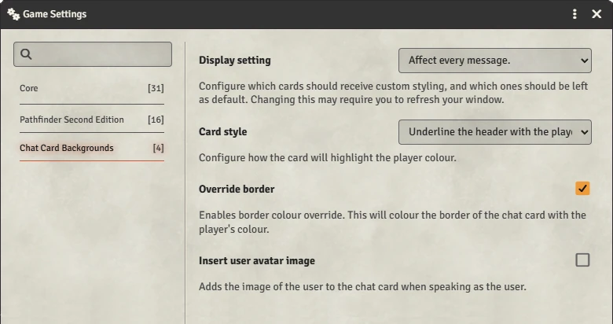
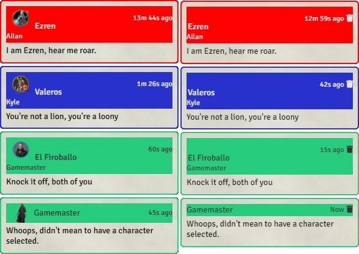
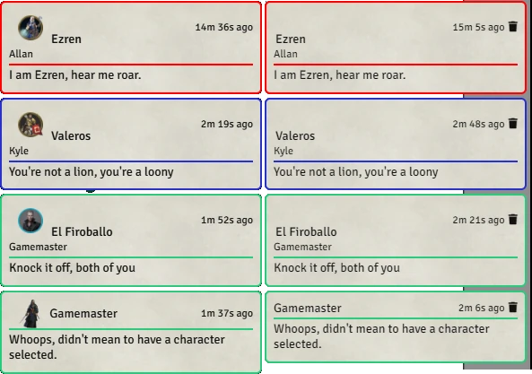
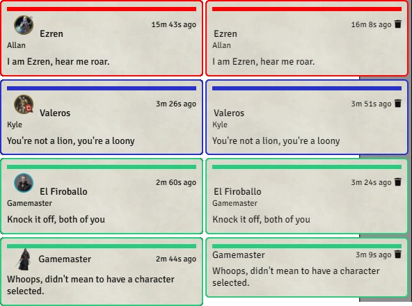
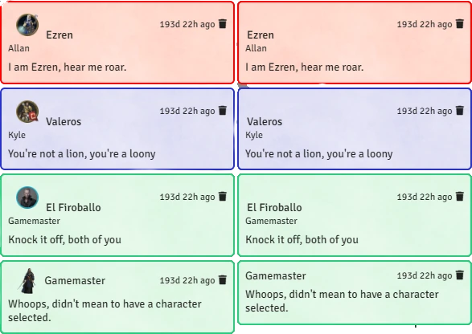

# FoundryVTT Chat Card Backgrounds

 

A module to alter the base chat cards. This will colour the cards based on the player who added the chat entry. Based on Deepflame's Chat Cards but
updated for Foundry v12-v13, and v14.

## Installation

In the setup screen, use the URL https://github.com/turthalion/chat-card-backgrounds/releases/latest/download/module.json to install the module.

Tested with PF2e and DnD5e systems, and briefly with PF1e to support a user request.

V14 testing with PF1e has been minimal thus far as as of 2026-04-21 the PF1e system has not been updated with a V14 release.

## Usage

As GM go to the **Manage Modules** options menu in your **World Settings** tab then enable the **Chat Card Backgrounds** module.

## Options
  
Options available are:
* Display setting: choose to affect every message, your own and GM messages, just your own, just the GM, all players, or no messages
* Card style: choose to change the header colour, underline the header, draw a coloured bar at the top of the message, colour the full card, or provide no player colouring inside the chat card.
* Override border: choose to colour the border of the chat card
* Insert user avatar image: choose to add the image of the user to the chat card when speaking as the user.

Note that depending on player colour and the colouring options chosen, full visibility of chat card messages may be compromised. Best guess efforts to arrive at a suitable text colour have been made in the code, but certain player colours may still cause issues, depending on the colour and/or your game system.

In Foundry V14, this module leverages the V14 support for speaking as the user or in-character. When speaking as the user, the user's avatar can
optionally be added to the message. When speaking in-character, no images are added and those decisions are left to the system.

## Notes
* If using Foundry v12, image support is disabled to avoid double-stacking of images
* If using Foundry v13, and DnD 5e (and possibly other systems) you must manually disable the chat images in the module to avoid double-stacking.
* Certain items may have visibility issues with full chat card colouring, depending on your system and the chosen colours.
* [V13.1.3](https://github.com/turthalion/chat-card-backgrounds/releases/download/13.1.3/module.json) is the final release supporting Foundry v12 and
  Foundry v13
* Completely revamped for V14 to hook on renderChatMessageHTML instead of depending on a base template

## Styles

### Header style
  
Coloured header, with or without pictures

### Underline style
  
Underline style, with or without pictures

### Coloured bar style
  
Coloured bar style, with or without pictures

### Full message style
  
Full message style, with or without pictures.

## Thanks

With kind thanks to Deepflame for a great module.

## License

This package is under an [MIT license](LICENSE) and the [Foundry Virtual Tabletop Limited License Agreement for module development](https://foundryvtt.com/article/license/).

## Bugs

You can submit bugs via [Github Issues](https://github.com/turthalion/chat-card-backgrounds/issues/new/choose).

