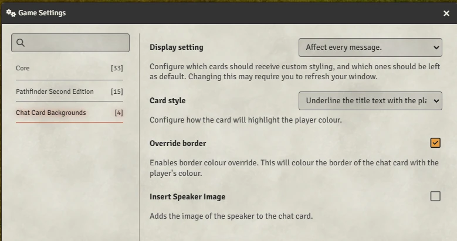
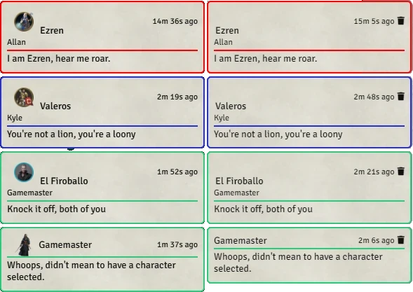
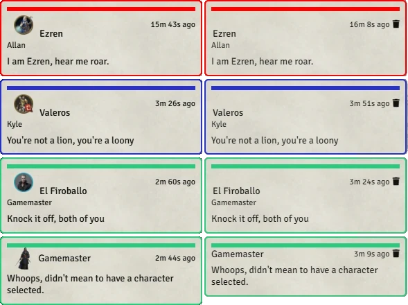

# FoundryVTT Chat Card Backgrounds

 

A module to alter the base chat cards. This will colour the cards based on the player who added the chat entry. Based on Deepflame's Chat Cards but
updated for Foundry v12-v13.

## Installation

In the setup screen, use the URL https://github.com/turthalion/chat-card-backgrounds/releases/latest/download/module.json to install the module.

## Usage

As GM go to the **Manage Modules** options menu in your **World Settings** tab then enable the **Chat Card Backgrounds** module.

## Options
  
Options available are:
* Display setting: choose to affect every message, your own and GM messages, just your own, just the GM, all players, or no messages
* Card style: choose to change the header colour, underline the title text, or draw a coloured bar at the top of the message
* Override border: choose to colour the border of the chat card
* Insert Speaker Image: choose to add the image of the speaker to the chat card
  * If this option is selected, and the message author does not have a token controlled on the scene, their avatar image will be used instead

## Styles

### Header style
  
Coloured header, with or without pictures

### Underline style
  
Underline style, with or without pictures

### Coloured bar style
  
Coloured bar style, with or without pictures

## Thanks

With kind thanks to Deepflame for a great module.

## License

This package is under an [MIT license](LICENSE) and the [Foundry Virtual Tabletop Limited License Agreement for module development](https://foundryvtt.com/article/license/).

## Bugs

You can submit bugs via [Github Issues](https://github.com/turthalion/chat-card-backgrounds/issues/new/choose).

